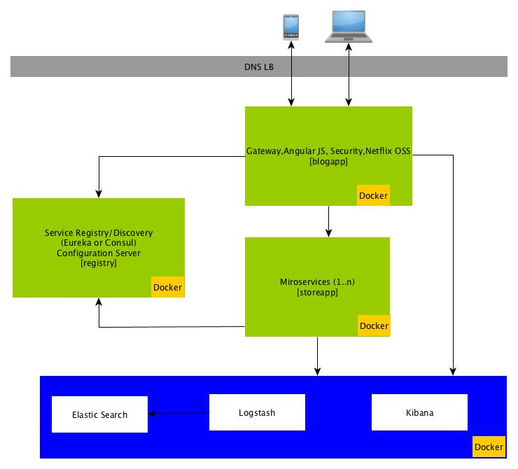

## Spring Framework Based Next Gen Mircoservices Based Reference Architeture Impl

   This project aims to show the next generation microservices architecture using:
    1. Eureka based service registry using Netflix Zuul [registry](https://github.com/mgorav/serviceregistry)
    2. Gateway with Angular JS 5.0/Type Script using Spring BOOT/Cloud  [blogapp](https://github.com/mgorav/blogapp)
        - Dev env with H2
        - Prod with mysql
    3. [storeapp](https://github.com/mgorav/storeapp) Microservice
        - MangoDB
        - Postgress
    
    All of the above application are containerized usig Docker and also uses yarn for dependency
    management. Last but not the lease Hazelcast is used as distributed cache. KPI gather using micrometer, 
    elastic search
    
     
    
 ## Instructions to execute
 
 1. Start service registry
    ```
        git@github.com:mgorav/serviceregistry.git
       ./mvnw
    ```
    This will run the service registry on port 8761
  
 2. Start blogapp
  
    ```
       git@github.com:mgorav/blogapp.git 
       ./mvnw
    ```
        This will run the blogapp on port 6060
      
        
 3. Start storeapp
   
     ```
        git@github.com:mgorav/storeapp.git
        ./mvnw
     ```
         This will run the storeapp on port 6061
         
   
   Next generation reference architecture is ready.